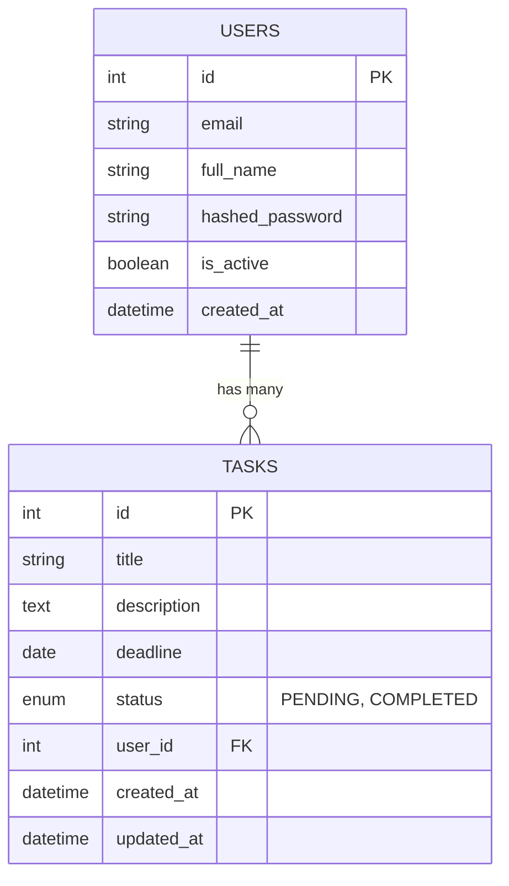

# Data Model

## ER Diagram

## Schema Definitions

### Users
- **id**: Primary Key
- **email**: Unique, Indexed
- **full_name**: Optional
- **hashed_password**: Security sensitive
- **is_active**: Boolean flag
- **created_at**: Timestamp

### Tasks
- **id**: Primary Key
- **title**: Mandatory
- **description**: Optional text
- **deadline**: Optional date
- **status**: Enum (PENDING, COMPLETED), default PENDING
- **user_id**: Foreign Key to Users.id
- **timestamps**: created_at, updated_at
